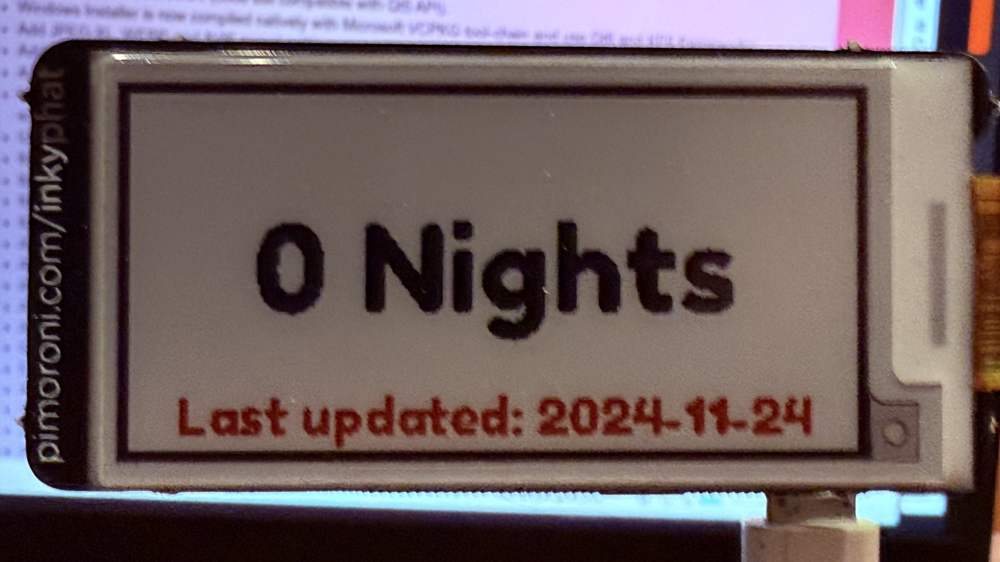

# dishes-scoreboard

In our house the kids sometimes have a hard time with quality of chores. In order to assist, I have this
project which can help keep track of the score board for successful jobs. It's not a complicated project,
but it's hopefully helpful.

## Hardware

The hardware for this project is pretty simple:

- Raspberry Pi Zero 2W
- 64GB micro SD card
- Pimoroni Inky PHAT ePaper display (the 2.13" one, 250x122 resolution)

## Install

1. Configure your Pi to the point where you can run the examples.

> [!IMPORTANT]
> When you're configuring the venv, put it in `~/venv/inky`

2. Place this code in `~/Devel/dishes-scoreboard`
3. `cp scoreboard.service ~/.config/systemd/user`
4. `systemctl --user daemon-reload`
5. `systemctl --user enable scoreboard`
6. `systemctl --user start scoreboard`

## Usage

- You'll want to go to your RPi on port 5000

